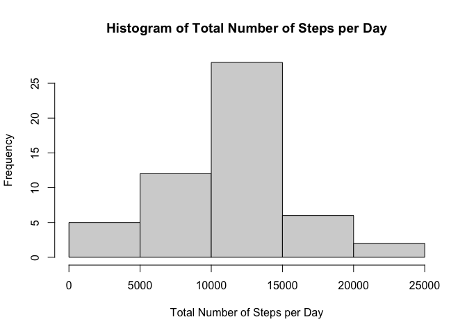
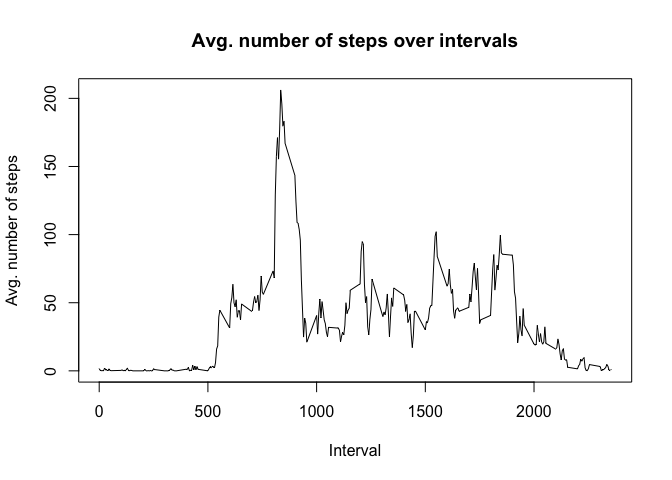
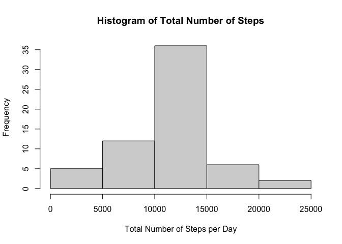
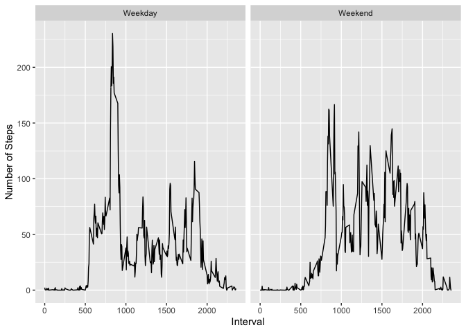

## Loading the Libraries

```r
library(knitr)
library(ggplot2)
library(dplyr)
```

```
## 
## Attaching package: 'dplyr'
```

```
## The following objects are masked from 'package:stats':
## 
##     filter, lag
```

```
## The following objects are masked from 'package:base':
## 
##     intersect, setdiff, setequal, union
```

```r
opts_chunk$set(echo = TRUE, results = 'hold')
```

## Loading and preprocessing the data
* unzip and read the table
* remove the NA values 
* convert the date to a Date format

```r
unzip("activity.zip")  
data <- read.table(file="activity.csv", header=TRUE, sep=",")  
activity <- data[!is.na(data$steps),]
activity$date <- as.Date(activity$date, format="%Y-%m-%d")
str(activity)
```

```
## 'data.frame':	15264 obs. of  3 variables:
##  $ steps   : int  0 0 0 0 0 0 0 0 0 0 ...
##  $ date    : Date, format: "2012-10-02" "2012-10-02" ...
##  $ interval: int  0 5 10 15 20 25 30 35 40 45 ...
```

## What is mean total number of steps taken per day?

#### Compute the aggregate daily steps

```r
act_by_date <- aggregate(steps ~ date, data = activity, FUN=sum)
head(act_by_date)
```

```
##         date steps
## 1 2012-10-02   126
## 2 2012-10-03 11352
## 3 2012-10-04 12116
## 4 2012-10-05 13294
## 5 2012-10-06 15420
## 6 2012-10-07 11015
```

#### Histogram of daily steps

```r
hist(act_by_date$steps, main="Histogram of Total Number of Steps per Day", xlab = "Total Number of Steps per Day")
```

<!-- -->

#### The Mean and Median number of daily steps

```r
mean(act_by_date$steps)
median(act_by_date$steps)
```

```
## [1] 10766.19
## [1] 10765
```

## What is the average daily activity pattern?

```r
activity_by_int <- aggregate(steps ~ interval, activity, mean)
plot(activity_by_int$interval, activity_by_int$steps, type='l', 
     main="Avg. number of steps over intervals", xlab="Interval", 
     ylab="Avg. number of steps")
```

<!-- -->

#### Which 5-minute interval, on average across all the days in the dataset, contains the maximum number of steps?

```r
num <- which.max(activity_by_int$steps)
print(paste("The interval with maximum number of steps", activity_by_int[num,2], "is", activity_by_int[num,1], " at index ", num))
```

```
## [1] "The interval with maximum number of steps 206.169811320755 is 835  at index  104"
```

## Imputing missing values
#### Calculate and report the total number of missing values in the dataset (i.e. the total number of rows with NAs)

```r
sum(is.na(data$steps))
```

```
## [1] 2304
```

#### The strategy for filling in all of the missing values in the dataset is using the mean interval values

#### Create a new dataset that is equal to the original dataset but with the missing data filled in.

```r
new_data <- data
activity_by_int <- aggregate(steps ~ interval, data, mean)
for (i in 1:nrow(new_data)) {
  if (is.na(new_data$steps[i])) {
    interval_value <- new_data$interval[i]
    steps_value <- activity_by_int[activity_by_int$interval == interval_value,]
    new_data$steps[i] <- steps_value$steps
  }
 }
```

#### Make a histogram of the total number of steps taken each day and Calculate and report the mean and median total number of steps taken per day.

#### New Histogram of daily steps

```r
new_act_by_date <- aggregate(steps ~ date, data = new_data, FUN=sum)
hist(new_act_by_date$steps, main="Histogram of Total Number of Steps", xlab = "Total Number of Steps per Day")
```

<!-- -->

#### The new mean and median values

```r
mean(new_act_by_date$steps)
median(new_act_by_date$steps)
```

```
## [1] 10766.19
## [1] 10766.19
```
#### The new mean and median values became the same (10766.19,10766.19), they were different before (10766.19,10765)

## Are there differences in activity patterns between weekdays and weekends?

#### Add a new column to differentiate the weekdays and weekends

```r
new_data$day_type <- weekdays(as.Date(new_data[,2]))
new_data$day_type[new_data$day_type %in% c("Saturday","Sunday")] <- "Weekend"
new_data$day_type[new_data$day_type != "Weekend"] <- "Weekday"
new_data$day_type <- as.factor(new_data$day_type)
```

#### Draw the Plot

```r
act_new <- aggregate(steps ~ interval + day_type, new_data, mean)
qplot(x=interval, y=steps, data=act_new, geom="line", xlab="Interval", ylab="Number of Steps") + facet_wrap(~day_type, ncol=2)
```

<!-- -->

#### Even though the weekdays has a higher peak at some point, weekends show more consistent activity over time. So this person seems like more active over the weekends.
